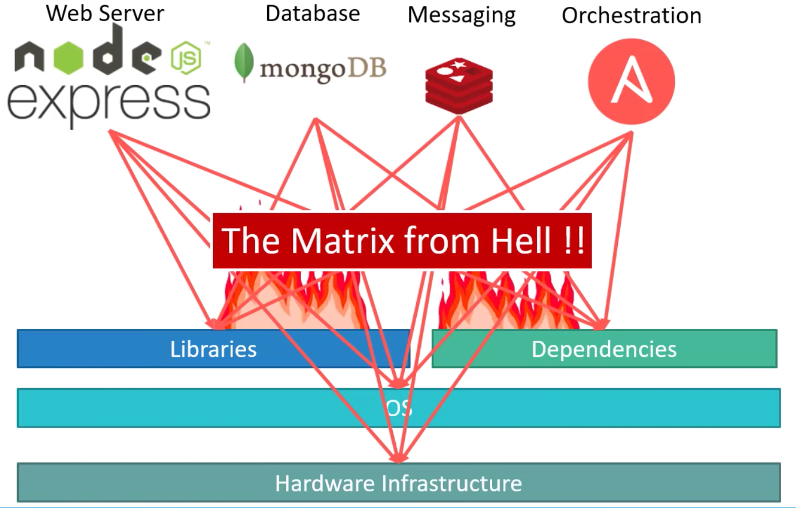
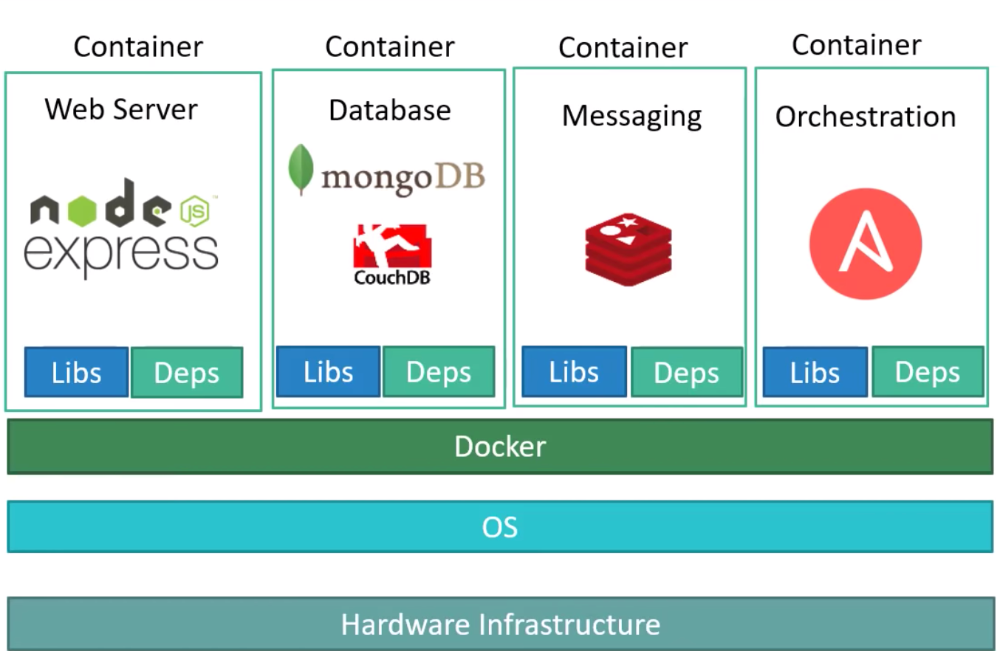
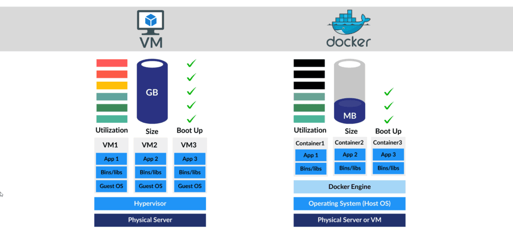

## 什么是容器 container
容器（Container）通常指的是一种技术，用于将应用程序及其依赖项打包在一起，以便在不同的计算环境中运行，而无需担心环境的差异性。容器技术通常包括操作系统级虚拟化和隔离技术，使得应用程序能够在容器内独立运行，并与主机系统和其他容器隔离开来。

容器技术的核心概念是镜像（Image）。镜像是一个轻量级、独立的、可执行的软件包，其中包含了运行应用程序所需的一切：代码、运行时、系统工具、系统库以及设置。容器是由这些镜像实例化而来的运行时实体，镜像可以在多个容器中共享，因此具有很高的可重用性和可移植性。

容器技术的优势包括：
- **轻量级**：与虚拟机相比，容器的启动速度更快，占用更少的系统资源，因为它们共享主机系统的内核。

- **可移植性**：容器镜像可以在不同的环境中轻松部署和运行，无论是开发、测试还是生产环境。

- **隔离性**：容器之间具有良好的隔离性，使得它们可以相互独立运行，不受外部环境的影响。

- **可扩展性**：可以根据需求快速启动、停止和扩展容器，以满足不同负载和流量的需求。

- **便捷性**：容器提供了统一的部署和管理接口，使得应用程序的开发、测试和部署过程更加便捷和高效。

容器技术的代表性实现包括 Docker、Kubernetes 和容器化的操作系统（例如 CoreOS）。这些技术已经被广泛应用于云计算、微服务架构、持续集成/持续部署（CI/CD）等领域。

容器技术出现之前

容器技术出现之后

容器 vs 虚拟机

**容器 container 是指的一种技术，而 Docker 只是一个容器技术的实现**